# Dr Jay

Dr Jay is a private, on-device accountability app for iPhone (iOS 26+) that
tracks sleep, water, food, and optional exercise, and surfaces today's Health
step count—with praise when you deliver and a sharp roast when you do not.

## Screenshots

<table>
  <tr>
    <th>Today</th>
    <th>Daily Report</th>
    <th>Insights</th>
  </tr>
  <tr>
    <td>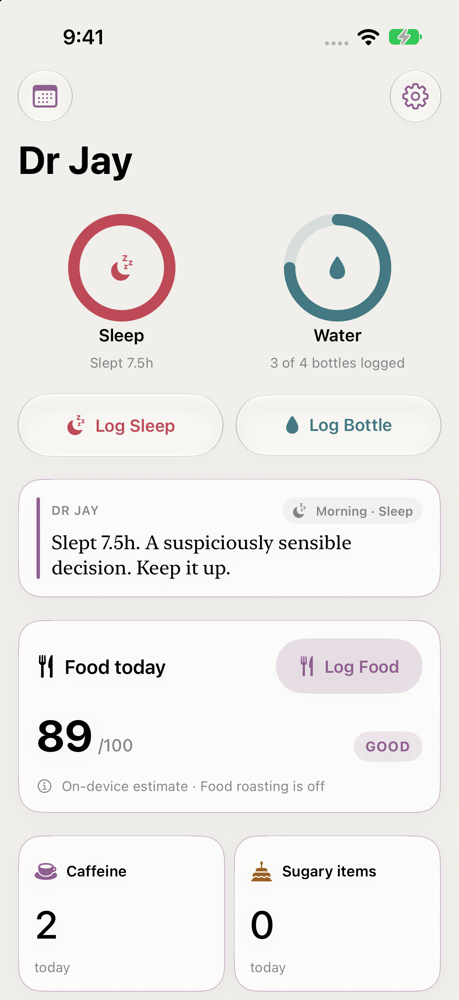</td>
    <td>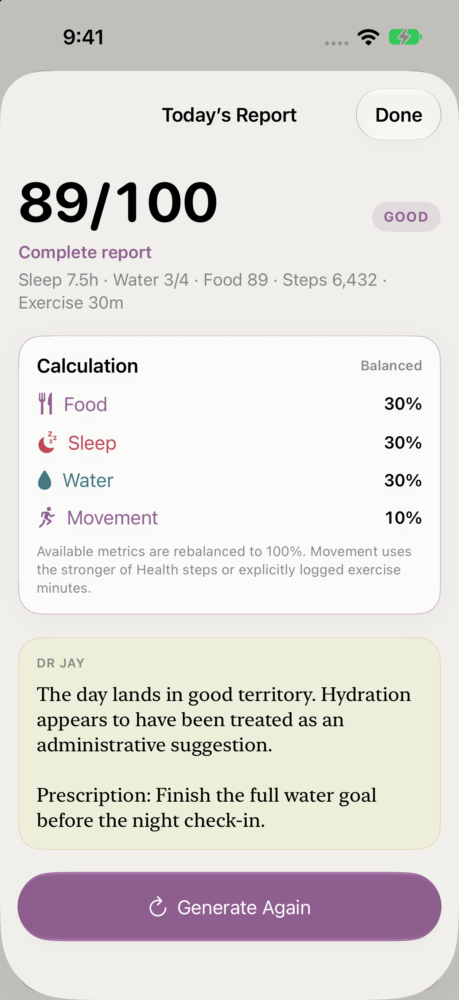</td>
    <td>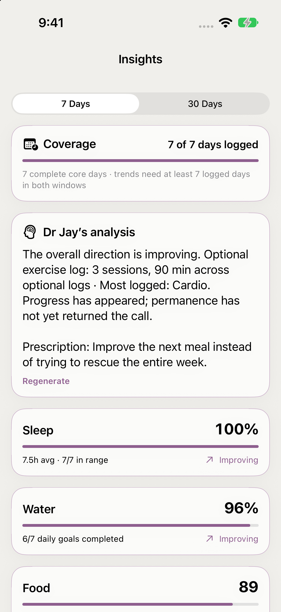</td>
  </tr>
  <tr>
    <td>Log your habits and see today's progress at a glance.</td>
    <td>Understand the day's score and hear Dr Jay's take.</td>
    <td>Explore 7- and 30-day patterns, priorities, and progress.</td>
  </tr>
</table>

<details>
<summary>Explore the app</summary>

### Daily logs and history

History keeps daily logs, food corrections, optional exercise, and streaks.
Today's activity cards surface Health steps and let you log exercise in your
own words.

<p>
  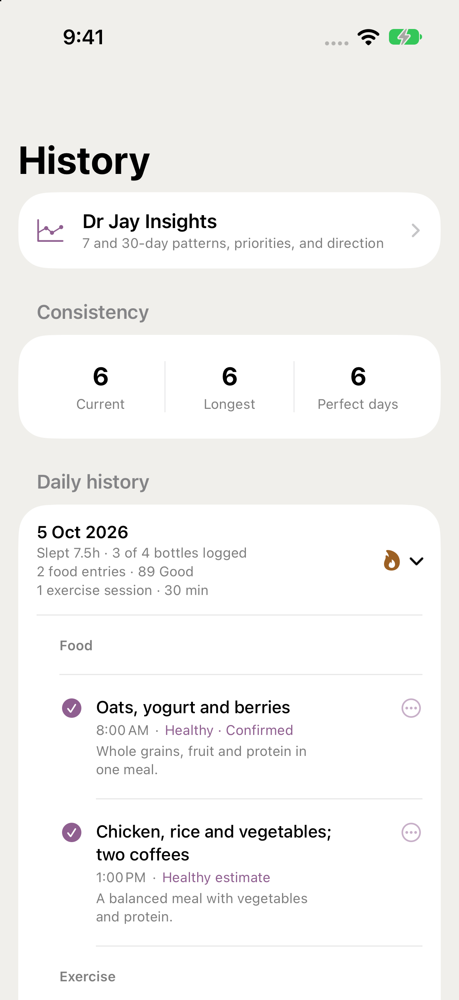
  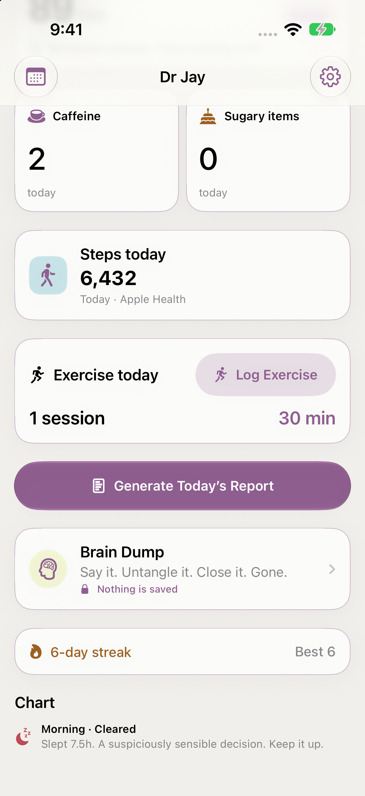
</p>

### Brain Dump

A private place to untangle your thoughts with playful commentary. Closing it
erases the conversation.

<p>
  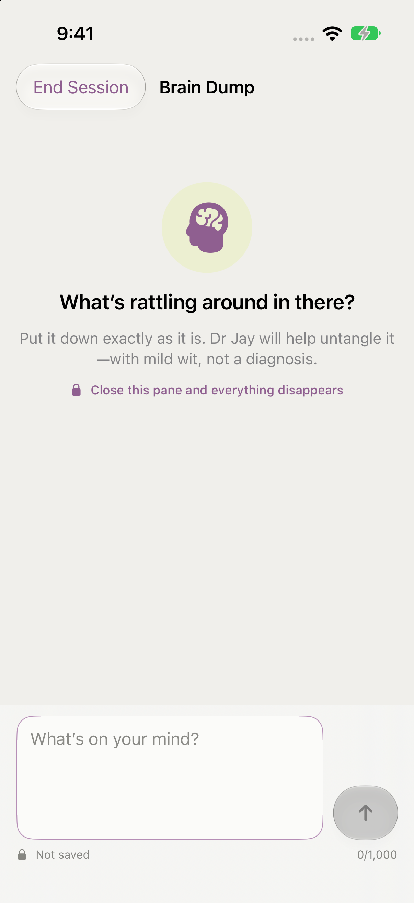
</p>

### Widgets, Live Activities, and Dynamic Island

Follow sleep and water progress from the Home Screen widget, the Dynamic
Island, and the Dr Jay Live Activity on the Lock Screen.

<p>
  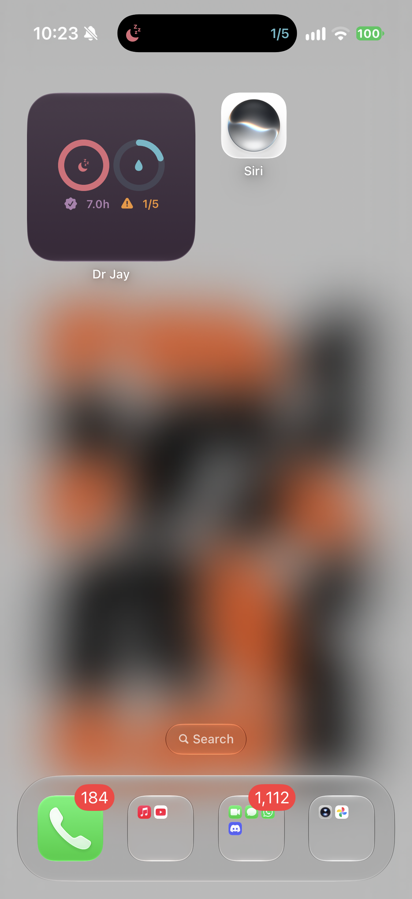
  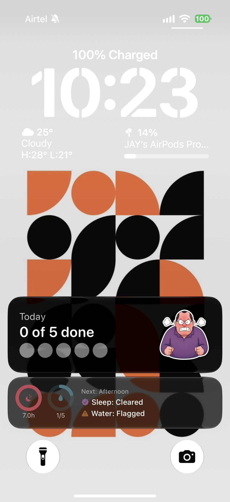
</p>

### Make it yours

Choose from seven themes with light and dark appearances. Settings also
controls Health access, check-in times, roast intensity, food feedback,
scoring profiles, optional Gemma commentary, and JSON backup and restore.

<p>
  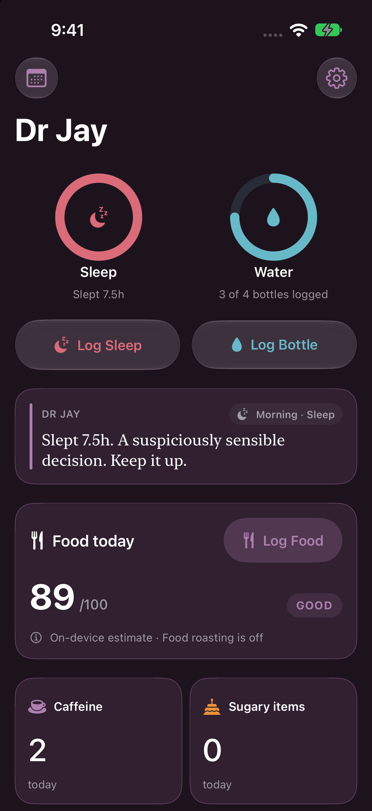
  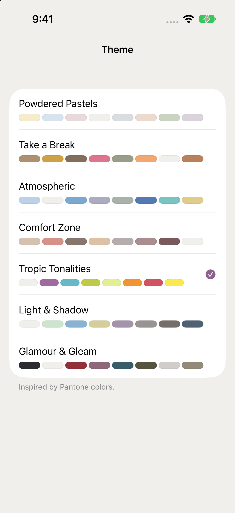
</p>

<p>
  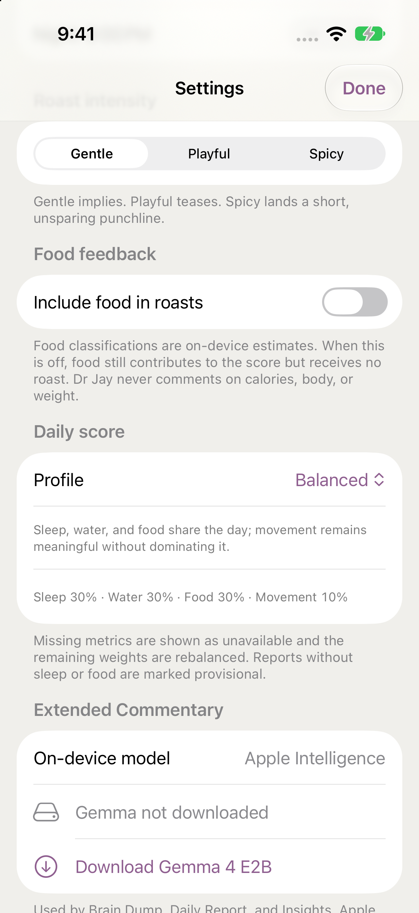
</p>

</details>

## What it tracks

- **Sleep:** a healthy range of 6–9 hours. Sleep can be read from HealthKit or
  entered manually. A manual entry remains authoritative for the day unless
  the user explicitly replaces it with Health data.
- **Water:** progress toward a configurable full-day goal. Morning, afternoon,
  and night check-ins judge whether the complete daily goal has been reached;
  they do not estimate whether the user is "on pace."
- **Food:** plain-language meal and snack entries are analyzed on device. Each
  classification is an estimate that can be corrected. Food roasts are off
  by default and can be enabled in Settings. The Today screen rolls
  all analyzed entries into an order-independent daily score:
  **Good (80–100), Bad (60–79), or Ugly (0–59)**. Individual classifications
  can be corrected or deleted from History. A correction becomes private
  local memory: exact future matches use it automatically, while similar
  foods receive it only as context for a fresh assessment. The same analysis
  counts explicit caffeine-forward items and obvious sugary treats or
  sweetened drinks; naturally occurring and incidental sugar is excluded.
- **Steps:** today's cumulative count is read directly from Health for display
  and the daily report. It is never copied into Dr Jay's database or backup.
- **Exercise:** optional free-text entries preserve the user's original words
  and infer a broad activity category locally. Only an explicit duration such
  as `30 minutes` or `1 hour` affects the Movement component; entries without
  a duration are still saved and shown in History.

## Daily report

The overall score is deterministic. Choose a profile in Settings:

| Profile | Sleep | Water | Food | Movement |
| --- | ---: | ---: | ---: | ---: |
| Balanced (default) | 30% | 30% | 30% | 10% |
| Sleep Focus | 45% | 25% | 20% | 10% |
| Movement Focus | 25% | 20% | 20% | 35% |

These are product preferences, not validated medical weightings. Each component
is calculated as follows:

- **Food** — today's fixed food score, based on on-device estimates and corrections.
- **Sleep** — full credit from 6–9 hours, proportionally less below 6,
  and reduced above 9.
- **Water** — progress toward the complete daily bottle goal, capped at
  full credit.
- **Movement** — uses the higher of Health steps (normalized up to a soft
  8,000-step ceiling) or explicitly logged exercise minutes (normalized up to
  30 minutes). The two are never added together, preventing double-counting.
  These are scoring references, not medical targets.

Missing metrics are excluded and the available weights are proportionally
normalized, so unavailable steps or exercise never lower the score. Missing
sleep or food is shown explicitly and marks the report provisional. The report
shows configured and effective weights so this rebalancing is visible. Overall scores use
**Good (80–100), Bad (60–79), and Ugly (0–59)**.

The report can be generated on demand from Today. Its score, verdict, and
calculation remain fixed; Swift writes the factual verdict and action while
the selected on-device model contributes only a validated, non-factual barb.
Good receives reluctant clinical approval, Bad roasts the weakest
major factor, and Ugly receives the sharper clinical roast. The model
is instructed not to repeat the visible score, weights, or metric list.
Intensity changes the construction, not merely a few adjectives: Gentle uses
indirect clinical irony, Playful uses a direct absurd comparison, and Spicy
uses a short accusation with no advice, hedging, or soft landing. Swift fixes
the single verified roast target and rejects generated lines that claim a
failure in any other metric. A local target- and intensity-aware fallback is
used when generation is unavailable or violates that contract. Gentle is the
default for new installs; existing intensity preferences are preserved. Food
is excluded as a roast target unless explicitly enabled. Commentary must not
discuss calories, body, or weight.

At 10 p.m., a local notification delivers the latest deterministic report
available when it was scheduled. The notification does not depend on the
language model running at delivery time.

## Brain Dump

Brain Dump is an ephemeral mindfulness conversation with Dr Jay. Closing the
pane immediately discards every turn; prompts and replies are not persisted,
logged, exported, or included in backups. Deterministic local routing blocks
prompt extraction, medical instructions, vulnerable beliefs, immediate-risk
content, and unrelated task requests before generation.

Apple Intelligence is the default responder. **Settings → Extended Commentary** can
optionally download and select Gemma 4 E2B for Brain Dump, Daily Report, and
Insights. The 2.59 GB LiteRT-LM artifact is
downloaded in the background, excluded from backups, and activated only after
its exact byte count, file signature, SHA-256 checksum, and LiteRT engine
initialization all succeed. Interrupted transfers retain resumable download
data. The model can be deleted independently without affecting app history.

The Today screen puts sleep and water logging actions and the actionable
food card first, followed by caffeine and sugary-item counters, the read-only
Steps card, optional Exercise card, and the manual report action. Only sleep
and water use goal rings. Buttons inside content cards use standard bordered
styles; glass is reserved for separate controls and navigation. History contains the detailed daily
record, food entries, exercise entries, corrections, and previous check-ins.
Current and longest streaks count consecutive days on which both
sleep and water goals were completed; food and steps do not affect streaks.

**Dr Jay Insights** in History computes private 7-day and 30-day views from
the existing log. Swift calculates coverage, goal adherence, direction,
exposure totals, optional exercise activity, priorities, and cautiously worded patterns. Swift writes the
factual interpretation and next action; the selected on-device model contributes
only a validated barb. Trends require at least seven
logged days in both comparison windows, generated commentary is not stored,
and steps remain excluded because historical step totals are never persisted.

## Privacy and resilience

- Health access is read-only.
- Roasts and food analysis use Apple's Foundation Models on device; food logs
  and health data are not sent to a server.
- Brain Dump, Daily Report, and Insights inference stays on device with either
  Apple Intelligence or the optional Gemma model. The model file and provider
  preference are separate from deliberately non-persistent generated text.
- Sleep and water roasts use a curated local fallback bank when Apple
  Intelligence is unavailable. Food remains safely logged as unanalyzed when
  the model is unavailable and can be classified manually from History.
- App data is stored locally with SwiftData in the shared App Group container.
- JSON export/import in **Settings → Data** preserves sleep, water, food
  entries, scores, exercise logs, learned food corrections, and check-in history; streaks are
  rebuilt from those daily logs after import. The current export schema is
  version 7; versions 1–6 remain import-compatible, and older manual food
  corrections are recovered where possible. A backup leaves the app only when
  the user chooses to share the exported file. Step counts and generated daily
  report commentary are intentionally excluded from storage and JSON backups.

## Platform features

- Seven selectable Pantone 2026-inspired themes, each adapted for light, dark,
  and increased-contrast appearances. Theme changes apply immediately and are
  shared with widgets; Tropic Tonalities remains the default.
- **SwiftUI + SwiftData** for the app and App Group-backed history.
- **FoundationModels** for on-device food analysis and Dr Jay's generated
  roast, approval, and manual daily-report commentary, with gentle, playful,
  and spicy intensity levels.
- **LiteRT-LM** for optional Gemma 4 E2B extended commentary. Apple
  Intelligence remains the default because Gemma requires roughly 2.59 GB of
  storage and substantially more runtime memory.
- **HealthKit** for read-only sleep import and an ephemeral current-day step
  count, with opportunistic background step refresh.
- **ActivityKit** for sleep and water progress on the Dynamic Island and Lock
  Screen.
- **WidgetKit** for sleep and water Home Screen and Lock Screen widgets.
- **Quick-log widgets:** **Add 1h Sleep** and **Log 1 Bottle** log directly
  without opening the app UI. Add either from the Dr Jay widget gallery on
  the Home Screen or Lock Screen. Sleep adds one hour and makes manual sleep
  authoritative for today, just like an in-app entry. Each tap refreshes
  progress, check-in history, the backup, and existing Live Activities;
  quick-log commentary uses the local intensity-aware fallback bank.
- **App Intents** for logging bottles or sleep and checking current status
  through Siri.
- Configurable morning, afternoon, and night local notifications, plus an
  exact-time 10 p.m. report. Today is personalized from the latest available
  values; a rolling week of generic fallbacks avoids replaying stale metrics
  if the app receives no refresh.

## Setup

1. Install Xcode with the iOS 26+ SDK and install XcodeGen if needed:
   `brew install xcodegen`.
2. Generate the Xcode project with your Apple Developer Team ID:

   ```sh
   DEVELOPMENT_TEAM=YOUR_TEAM_ID xcodegen generate
   ```

   `Roastie.xcodeproj` is generated from `project.yml` and intentionally
   gitignored. Regenerate it after adding or removing source files.
3. Open `Roastie.xcodeproj`. The default bundle IDs are
   `dev.jeyanth.roastie` and `dev.jeyanth.roastie.widgets`. Change
   `bundleIdPrefix` and the matching App Group in `project.yml` for another
   developer account, then regenerate the project.
4. Confirm both targets use the same App Group entitlement.
5. Build and run the `Roastie` scheme on a real device with Apple Intelligence
   enabled for the complete experience.

## Validation

The project includes unit coverage for goal calculation, streaks, check-in
window selection, snapshot migration, backup import, food scoring and exposure
counter boundaries, learned food-memory matching, daily-report weighting, missing-step
handling, Brain Dump safety routing, and Good/Bad/Ugly report boundaries.
Compile the app and test bundle
without executing tests with:

```sh
xcodebuild -project Roastie.xcodeproj -scheme Roastie \
  -configuration Debug -destination 'generic/platform=iOS' build-for-testing
```

## Known constraints

- iOS does not run app code when a local notification is delivered. Its text
  therefore uses the latest values from the most recent foreground or Health
  background refresh. Future generic 10 p.m. fallbacks never repeat stale
  metrics as though they belonged to a new day.
- Background processing is opportunistic and acts as a day-rollover backstop;
  foreground refresh remains the primary update path. Health step observer
  delivery is also opportunistic rather than a real-time pedometer feed.
- A free Apple Developer signing profile normally expires after seven days.
  Export a JSON backup before reinstalling if persistent history matters.
- Default goals are 6–9 hours of sleep and four 750 ml bottles of water; water
  settings are configurable.

## License

Dr Jay's original source code is available under the
[Apache License 2.0](LICENSE). Copyright and bundled-component attribution is
recorded in [NOTICE](NOTICE). Third-party components retain their own license
terms, including the vendored LiteRT-LM package at `Vendor/LiteRTLM/LICENSE`.
